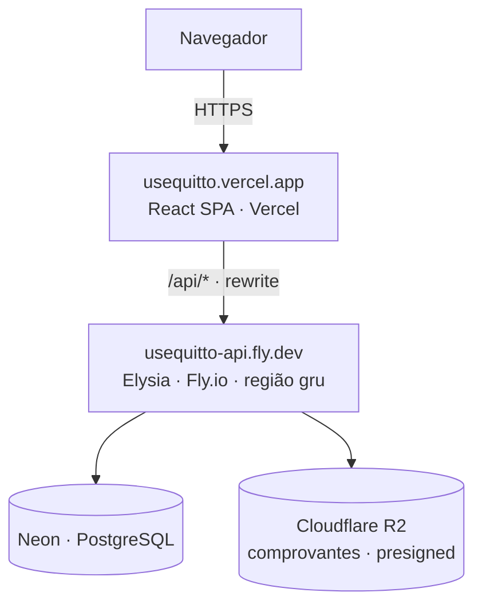
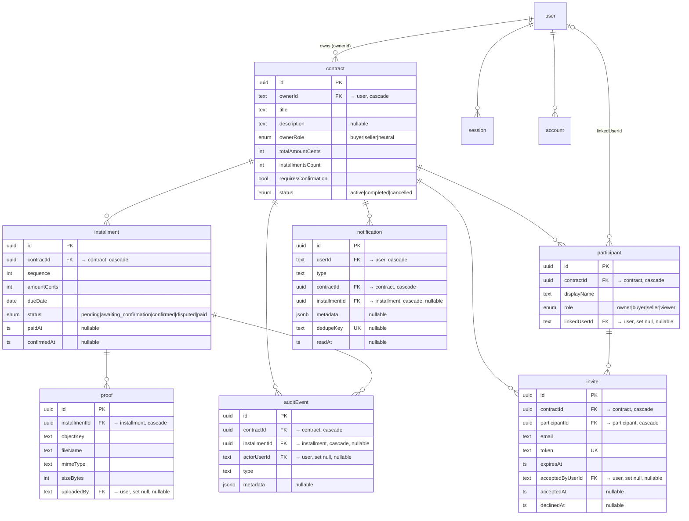

# Arquitetura — Quitto

Visão técnica do Quitto. Para o **o quê** (requisitos), veja [requisitos.md](requisitos.md).

## 1. Visão geral

Monorepo **Bun workspaces + Turborepo** com um **SPA React** (Vercel) e uma **API Elysia**
(Fly.io), tipados **ponta a ponta** via Eden Treaty (sem geração de código). O front é
**same-origin**: chama `/api/*` no próprio domínio e um **reverse-proxy** (rewrite na Vercel)
encaminha para o backend — mantendo o **cookie de sessão first-party**.

## 2. Topologia



- O rewrite (`apps/web/vercel.json`) faz `/api/:path*` → `https://usequitto-api.fly.dev/api/:path*`
  e serve `index.html` como fallback do SPA. Como o browser vê tudo no mesmo domínio, o
  **cookie de sessão é first-party** (sem CORS/SameSite tortuoso).
- A API roda no Fly em **scale-to-zero** (ver §9d).

## 3. Stack por camada

| Camada | Tecnologias |
|---|---|
| **Web** | React 19 · Vite · TanStack Router & Query · Tailwind v4 · shadcn/Radix |
| **API** | Bun · Elysia · Drizzle ORM · PostgreSQL · Better Auth (Google + e-mail/senha) |
| **Tipos** | Eden Treaty — cliente tipado ponta a ponta, sem codegen |
| **Storage** | Cloudflare R2 (prod) · MinIO (dev/CI) — S3-compatível, upload pré-assinado |
| **Infra** | Vercel (web) · Fly.io (API) · Neon (DB) · GitHub Actions (CI/CD) |
| **Observabilidade** | Sentry (web + API, só prod) · UptimeRobot (uptime) |
| **Qualidade** | TDD · Biome/Ultracite · Lefthook · `bun test` · Vitest · Playwright + axe |

## 4. Estrutura do monorepo

```
apps/
  api/        # backend Elysia (rotas/módulos, auth, drizzle, storage, sentry)
  web/        # SPA React (rotas, hooks, componentes)
packages/
  shared/     # contratos compartilhados: enums de domínio, schemas Zod, helpers puros
e2e/          # suíte Playwright (+ axe) dos fluxos críticos
```

`packages/shared` é a **fonte única** de vocabulário de domínio (enums), schemas de validação
(Zod) e helpers puros (ex.: geração de cronograma — `addMonths`/`splitAmount`/`generateSchedule`),
consumidos por API e web.

## 5. Modelo de dados

Tabelas do **Better Auth** (`user`, `session`, `account`, `verification`) + tabelas de
**domínio**. Dinheiro em **centavos inteiros**; `dueDate` é `date` (ISO `YYYY-MM-DD`).



Notas:
- **`onDelete`:** apagar um `user` cascateia `contract`/`session`/`account`/`notification` e
  **anula** (`set null`) os vínculos em `participant.linkedUserId`, `proof.uploadedBy`,
  `invite.acceptedByUserId`, `auditEvent.actorUserId`. Apagar um `contract` cascateia tudo
  abaixo dele.
- **`participant.linkedUserId`** liga o "slot" do participante a uma conta de usuário (nulo
  até o convite ser aceito).
- **`notification.dedupeKey`** (único) evita avisos duplicados; **`invite.token`** (único) é o
  portador do link de convite. (As tabelas do Better Auth também têm `session.token` único.)
- Toda tabela tem `createdAt` (e as do Better Auth, `updatedAt`) — omitidos do diagrama por
  brevidade.
- O schema usa `pgTable` puro (sem `relations()` do Drizzle) — os joins são **explícitos** por
  módulo, mantendo os tipos simples (ver §9f).

## 6. Vocabulário de domínio

Definido em `packages/shared/src/domain.ts` (fonte única):

- **`CONTRACT_STATUS`**: `active` · `completed` · `cancelled`.
- **`INSTALLMENT_STATUS`**: `pending` · `awaiting_confirmation` · `confirmed` · `disputed` · `paid`.
- **`OWNER_ROLE`**: `buyer` · `seller` · `neutral` (na criação só `buyer`/`seller` são oferecidos).
- **`PARTICIPANT_ROLE`**: `owner` · `buyer` · `seller` · `viewer`.
- **`DIRECTION`**: `pay` · `receive`.
- **`NOTIFICATION_TYPE`**: `proof_submitted` · `payment_confirmed` · `payment_disputed` ·
  `installment_paid` · `installment_due_soon` · `installment_overdue` · `participant_left` ·
  `invite_accepted` · `invite_declined`.
- **`AUDIT_TYPE`**: `proof_submitted` · `payment_confirmed` · `payment_disputed` ·
  `installment_paid` · `participant_left`.
- **`REMINDER_WINDOW_DAYS`** = 3 (lembrete de parcela a vencer). `isOverdue`/`isPaidStatus`
  são helpers puros do mesmo módulo.

## 7. Fluxos-chave

### 7.1 Autenticação / sessão

```
Login (web) ──▶ Better Auth (/api/auth/*) ──▶ Set-Cookie de sessão (first-party via rewrite)
Rota protegida ──▶ requireSession (beforeLoad) ──▶ GET /api/me ──▶ getSession(headers)
                     └─ 401? redireciona /login   └─ erro transitório? retry+timeout (cold start)
```

`apps/api/src/auth.ts` configura `emailAndPassword` (com reset/verificação), `emailVerification`
(obrigatória em prod), `rateLimit` (regras custom) e Google opcional. A sessão é por cookie;
`requireAuth`/`getSession` validam no servidor.

### 7.2 Ciclo de comprovante (pagamento)

```
Pagador: POST /proofs/presign ──▶ URL pré-assinada (PUT, 5 min)
Pagador: PUT direto no R2/MinIO (arquivo não passa pela API)
Pagador: POST /proofs (objectKey) ──▶ valida existência/tipo/tamanho, cria proof
   ├─ requiresConfirmation? ──▶ parcela: pending/disputed → awaiting_confirmation  (audit proof_submitted, notifica aprovador)
   │     Aprovador: POST /confirm ──▶ awaiting_confirmation → confirmed (paidAt/confirmedAt)  (audit payment_confirmed, notifica pagador)
   │     Aprovador: POST /dispute ──▶ awaiting_confirmation → disputed (motivo)               (audit payment_disputed, notifica pagador)
   └─ sem confirmação ──▶ parcela → paid (paidAt)  (audit installment_paid)
Pagador (sem confirmação): POST /mark-paid ──▶ → paid
```

A máquina de estados vive em `apps/api/src/lib/installment-state.ts`. Cada transição grava
`auditEvent` e dispara `notification`.

### 7.3 Convite / aceite

```
Dono: cria slot (participant, role buyer/seller/viewer, linkedUserId null)
Dono: POST .../invite (email) ──▶ token (32 bytes hex), expira em 7 dias, e-mail best-effort
Convidado: GET /invites/:token ──▶ prévia (quem convidou, título, valor, partes); valida token/expiração/recusa
Convidado: POST /invites/:token/accept ──▶ [transação] valida e-mail confere + slot livre + não já participa
                                            └─ participant.linkedUserId = user; invite.acceptedAt; notifica dono
Convidado: POST /invites/:token/decline ──▶ invite.declinedAt; notifica dono
```

### 7.4 LGPD

`GET /api/me/export` serializa o grafo do usuário (contratos, parcelas, participações,
comprovantes, auditoria, notificações) em JSON. `DELETE /api/me` apaga a conta com cascata e
**purga best-effort** dos objetos no storage.

## 8. RBAC / capabilities

`apps/api/src/lib/contract-access.ts`:

- **`getContractRole`** resolve o papel do usuário no contrato (dono e/ou participante vinculado);
  quem não tem acesso recebe 404 (não vaza o contrato).
- **`getCapabilities`** deriva:
  - **`isPayer`** — papel `buyer`, **ou** o dono quando não há comprador vinculado.
  - **`isApprover`** — papel `seller`, **ou** o dono quando não há vendedor vinculado.
  - `viewer` não paga nem aprova.

Ou seja, o **dono herda** o papel que ainda não foi delegado a outra pessoa — permitindo o uso
solo (dono paga e aprova) e o uso entre partes (cada lado com sua capability). Como na criação
o dono escolhe `buyer` ou `seller` (o valor `neutral` do enum não é oferecido), ele sempre
resolve para um papel com acesso ao próprio contrato.

## 9. Decisões de arquitetura

**(a) Dinheiro em centavos inteiros.** `totalAmountCents`/`amountCents` são `integer`; nada de
float. Evita erros de arredondamento; a formatação BRL divide por 100 na borda (`formatBRL`).

**(b) Datas como string ISO, sem drift de fuso.** `dueDate` é `date` (`YYYY-MM-DD`); os helpers
(`packages/shared/src/date.ts`, `apps/web/src/lib/format.ts`) tratam datas por string e evitam
`new Date(iso)` (que parseia como UTC e desloca o dia). Fuso de referência:
`APP_TIME_ZONE = "America/Sao_Paulo"`.

**(c) SPA, não SSR.** O diagnóstico da "tela branca" foi **cold start** do Fly, não arquitetura.
Manter SPA simplifica o deploy e o cookie first-party (via rewrite); o custo (cold start) é
tratado na borda (§9d).

**(d) Scale-to-zero + cold start gracioso.** `fly.toml`: `min_machines_running = 0`,
`auto_stop_machines = "stop"`, `auto_start_machines = true` (região `gru`). Cold start medido
~4,1s (quente ~0,17s). Mitigado no front por 4 camadas: login instantâneo, warm-up ping,
retry+timeout no bootstrap de sessão e skeleton de marca (sem F5). Custo: R$0.

**(e) Eden Treaty ponta a ponta.** O cliente web infere os tipos direto da API — sem codegen.
Em troca, a versão do **Elysia precisa ser compatível** entre API e web; por isso o `elysia`
fica **pinado em `1.4.28`** em `apps/api` (drift de versão quebra a inferência do Eden).

**(f) Sem `relations()` do Drizzle.** O schema é `pgTable` puro; os joins são explícitos em
cada módulo. Mantém os tipos previsíveis e o controle de acesso explícito por query.

## 10. Observabilidade e operação

- **Sentry** (`@sentry/react` no web, `@sentry/bun` na API) — inicializa **só com DSN**
  (produção); `sendDefaultPii: false` + scrub de headers/cookies/query string; só captura 500
  inesperados na API (4xx/`AppError` não viram evento). Source maps do front sobem no build
  (gated por `SENTRY_AUTH_TOKEN`) e são apagados após o upload.
- **Uptime** — UptimeRobot monitora a **home do Vercel** (não `/api/ping`), para não acordar a
  máquina do Fly e anular o scale-to-zero.
- **CI/CD** (`.github/workflows/ci.yml`): `verify` (lint·typecheck·test·build) + `e2e`
  (Playwright·axe) como **gate** em todo push/PR; no `main`, `migrate` (Neon) → `deploy-api`
  (Fly) ∥ `deploy-web` (Vercel) → `smoke`. Nada vai a produção sem o gate passar.
- **Container** — Dockerfile single-stage Bun (`oven/bun:1`), `bun run apps/api/src/index.ts`.
